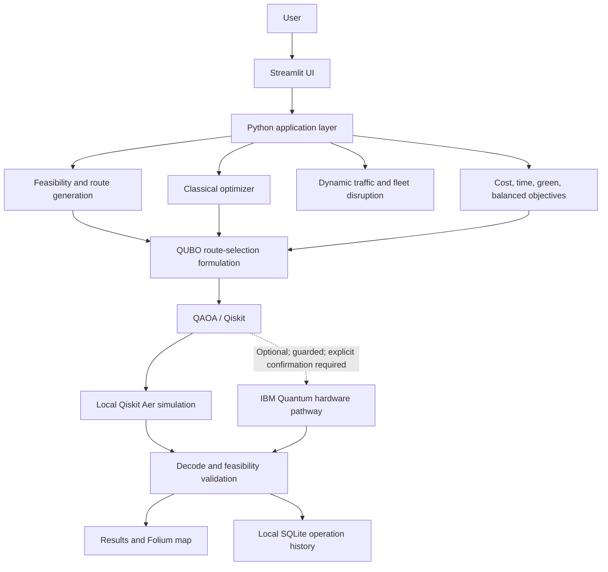

# QuantumRoute — Quantum-Enhanced Dynamic Last-Mile Route Optimisation

QuantumRoute is a Streamlit application that demonstrates hybrid classical
and QAOA-based planning for small last-mile delivery scenarios. Its
deterministic Demo Mode runs locally with Qiskit Aer; IBM Quantum is an
optional, guarded pathway and is not required for the demo.

## Quick Start

From the repository root, install the dependencies and start the application:

```powershell
python -m pip install -r requirements.txt
python -m streamlit run app.py
```

For a concise hackathon walkthrough, open **Demo Mode** and click
**▶ Run Full Demo**. The fixed local scenario shows a feasible baseline,
classical and local Aer results, simulated traffic and fleet changes,
objective/sustainability comparisons, route maps, and saved local history.
See the [official six-slide Qiskit Fall Fest submission](docs/QuantumRoute_Qiskit_Fall_Fest_Official_Template.pptx),
[supplementary editable 10-slide presentation](docs/QuantumRoute-Hackathon-Presentation.pptx),
[2–3 minute presenter script](docs/demo-script.md), and
[slide source](docs/hackathon-presentation.md). No IBM hardware job is needed
for this walkthrough.

The **A–F Guided Workflow** in the sidebar supports an origin and up to five
delivery destinations, each with its own demand, delivery window, and service
time. It previews all selected locations, then sends the full scenario through
the existing feasibility, classical, QUBO, and QAOA pipeline and displays
vehicle assignments for every destination. Inputs remain available when moving
Back and Next. This multi-delivery flow is separate from the point-to-point
Custom Route Planner.

The separate **Custom Route Planner** supports explicit browser location
permission or OpenStreetMap place search, OSRM point-to-point road alternatives,
and session-only CSV/XLSX fleet profiles. See the
[custom route planner guide](docs/custom-route-planner.md) and download the
[blank fleet CSV template](docs/fleet-data-template.csv). Place queries and
route coordinates are sent to public OpenStreetMap services only after the
corresponding search or route request is submitted; uploaded fleet rows are not
persisted to operation history.

## Architecture



The IBM node is optional: opening the hardware workspace, discovering
backends, and running a dry run do not submit a job. The workflow is restricted
to its supported small Demo Mode problem and requires explicit confirmation
before a real submission.

## Technology Stack

- **UI:** Streamlit
- **Application and optimization:** Python; classical feasibility and route
  optimization; simulated traffic/fleet re-optimization
- **Quantum:** Qiskit, Qiskit Optimization, Qiskit Algorithms, and Qiskit Aer
  for local QAOA
- **Optional hardware:** IBM Quantum Runtime, with guarded execution
- **Maps and routing:** Folium/Streamlit-Folium and optional OSRM road-routing
  requests; OSRM paths are separate from optimizer route selection
- **History:** SQLite
- **Tests:** Python `unittest`

## Selected Problem Statement

### VNQFF-08 — Quantum-Enhanced Last-Mile Route Optimisation

**Organizer problem context:** “Dynamic vehicle routing with multiple destinations, traffic conditions, capacity limits, and time windows creates difficult combinatorial optimization problems.”

**Our project scope:** a small, constrained last-mile routing instance with
multiple vehicles and destinations, vehicle-capacity limits, delivery time
windows, traffic conditions, route distance/time/cost, configured fuel and CO2
metrics, and dynamic re-optimization after traffic or fleet changes. The
application demonstrates these constraints; it does not claim to solve every
real-world routing requirement. The Proposed Solution section describes our
approach to this organizer problem.

## Dataset and Scenario Information

This project does not claim to use a large external machine-learning dataset.
Demo Mode uses deterministic synthetic/hardcoded routing scenarios. Benchmark
Mode generates deterministic scenario cases in code. Inputs include vehicle
capacities, delivery demands and destinations, time windows, traffic
conditions, fuel configuration, and route costs. These cases make optimizer
behavior reproducible for the configured scenario and seed; they are not a
representative sample of real delivery operations.

The scenario and data-generation code is in
[`route_dashboard/demo_mode.py`](route_dashboard/demo_mode.py),
[`route_dashboard/benchmark_suite.py`](route_dashboard/benchmark_suite.py),
[`route_dashboard/scenario.py`](route_dashboard/scenario.py), and
[`route_dashboard/routing.py`](route_dashboard/routing.py). The built-in Demo
Mode uses local coordinate estimates and does not request OSRM. In other
dashboard scenarios, optional OSRM requests can provide road distances, base
durations, and route geometry; those are routing inputs, not a delivery dataset
or live traffic feed. Traffic changes in Demo Mode are simulated.

## Proposed Solution

The hybrid workflow is:

Real-world routing constraints → classical feasibility filtering → feasible
route-option generation → QUBO formulation → Qiskit Optimization / Ising
conversion → QAOA → local Qiskit Aer simulation → route decoding → feasibility
validation → explicitly confirmed IBM Quantum hardware execution for the
supported Demo Mode case → dynamic traffic/fleet re-optimization.

The classical layer enumerates feasible routes and supplies route options to
the QUBO. QAOA samples selections from that formulation; the application then
decodes and validates results using the existing feasibility checks. This
keeps operational constraints and the exact classical baseline visible while
allowing a small quantum workflow to be evaluated. Hardware execution is a
separate, explicitly confirmed path for the supported demo problem. This
architecture does not establish quantum advantage.

## Classical Optimization Core

The current core accepts vehicles, deliveries, and caller-provided directed
distance and duration matrices. It checks vehicle capacity, delivery service
time windows, and vehicle shift end times; evaluates route costs; generates
feasible ordered routes; and selects a minimum-cost set of routes that covers
each delivery exactly once while using each vehicle at most once.

The exact baseline enumerates route permutations and is intended for small
hackathon instances. Delivery time windows constrain the start of service.
Route distance and elapsed time include the return leg to each vehicle's
configured end location. Elapsed time includes driving, waiting, and service.

## Qiskit Implementation Details: QAOA Route Selection

The QAOA layer reuses the feasible route options and costs from the classical
core. Each feasible vehicle-route option is one binary QUBO variable. The
objective sums route costs, adds a squared penalty for each delivery not being
covered exactly once, and adds pairwise penalties when multiple routes use the
same vehicle. Qiskit Optimization stores the QUBO and maps it to an Ising
operator; QAOA samples it using Qiskit Aer. Every selected route is decoded and
rechecked through the classical feasibility evaluator. A run with no valid sampled
route set is reported as a failure, not replaced with a fabricated result.

The local implementation uses Qiskit, Qiskit Optimization, Qiskit Aer for
simulation, and Qiskit Algorithms for QAOA. Install the pinned versions with
`python -m pip install -r requirements.txt`:

- `qiskit==2.5.2`
- `qiskit-optimization==0.7.0`
- `qiskit-aer==0.17.2`
- `qiskit-algorithms==0.4.0`
- `qiskit-ibm-runtime==0.50.0`
- `python-dotenv==1.2.1`
- `streamlit==1.58.0`
- `folium==0.20.0`
- `streamlit-folium==0.27.4`
- `pandas==3.0.4`

Run the full test suite from the repository root:

```powershell
python -m unittest discover -s tests -v
```

Verified on 2026-10-10 in the project `.venv`: **175 tests passed** with this
command. Re-run it after changes; this count describes that run, not a promise
about future test discovery.

Run a reproducible small exact-versus-QAOA comparison with:

```powershell
python -m examples.day2_comparison
```

The exact classical solver is the optimum for the same candidate route set;
QAOA uses stochastic sampling and is not expected to beat it on such a small
instance. For the hardware demonstration, optimized QAOA parameters are
extracted from the local Aer optimizer result and passed through a separate,
validated circuit adapter. Local Aer sampling and real IBM hardware sampling
are distinct executions. Hardware counts are decoded through the saved route
variable mapping and the resulting route is rechecked for feasibility.

## Results and Observations

The deterministic Demo Mode baseline produced the following physical metrics.
The local values are reproducible from the checked-in scenario and optimizer.
The prior IBM hardware claim has no durable job ID/result artifact and is
therefore **unverified**, not a verified hardware result. Automated IBM tests
use mocks and do not independently reproduce a hardware execution.

| Method | Distance | Travel time | Cost | Fuel | CO2 |
|---|---:|---:|---:|---:|---:|
| Classical Optimization | 18.225 km | 34.171 min | ₹1,854.19 | 1.640 L | 4.396 kg |
| Local Aer QAOA | 18.225 km | 34.171 min | ₹1,854.19 | 1.640 L | 4.396 kg |
| IBM Quantum hardware | **NOT VERIFIED** | — | — | — | — |

Do not treat the older `ibm_fez, 256 shots` statement as verified. A new
hardware result is reportable only when its durable JSON evidence and matching
human-readable report exist under
[`artifacts/ibm_hardware/`](artifacts/ibm_hardware/). A completed real hardware
execution demonstrates the workflow, not quantum advantage, speedup, or global
optimality.

The deterministic Normal-to-Heavy traffic comparison retained the same route
distance while increasing travel time and cost. Fuel and CO2 remained
unchanged because the configured fuel/emissions model depends on distance:

| Traffic | Distance | Travel time | Cost | Fuel | CO2 |
|---|---:|---:|---:|---:|---:|
| Normal | approximately 18.225 km | approximately 34.171 min | approximately ₹1,854.19 | 1.640 L | 4.396 kg |
| Heavy | approximately 18.225 km | approximately 52.965 min | approximately ₹2,497.46 | 1.640 L | 4.396 kg |

In the standalone objective comparison, Green Priority produced approximately
17.803 km, 33.382 min, ₹2,492.54 cost, 1.602 L fuel, and 4.294 kg CO2. This is a
different trade-off from the cost-focused baseline. Objective scores are
normalized for their respective profiles and are not directly rankable across
profiles; there is no universally best route.

## Run the tests

From the repository root, run:

```powershell
python -m unittest discover -s tests -v
```

The classical core uses the Python standard library. The Qiskit optimizer
requires the packages listed above.

## Day 3: Dispatch dashboard

Start the application from the repository root with:

```powershell
python -m streamlit run app.py
```

The dashboard starts with a small San Francisco scenario. Depot coordinates,
vehicle count and capacity, shift times, delivery destinations and coordinates,
demand, time windows, traffic, fuel or energy price, and driver hourly cost can
be edited before each run. Results come from the existing classical and QAOA
optimizers and are revalidated before they are displayed. QAOA runs locally on
Aer with an editable random seed and sampler configuration.

Local travel matrices use a coordinate distance estimate with a road adjustment
and traffic-scaled travel time. The optional OSRM table request only supplies
distance and duration; any request or matrix failure falls back to local
estimates. The map plots the entered coordinates and optimizer route order; its
OpenStreetMap basemap needs an internet connection. Local Aer QAOA is limited to
22 route-selection variables by the dashboard to avoid impractical simulation
sizes; larger cases still show the classical result and report that QAOA was
not run.

## Day 4: Benchmark mode

Open **Benchmark Mode** in the dashboard and select one built-in scenario
or **All scenarios**. The fixed-seed suite includes 2-, 3-, 4-, and 5-delivery
cases with multiple vehicle counts, traffic conditions, demands, and time
windows. It records solver-plus-validation runtimes, objectives, gaps, route
validity, and QAOA sample metadata. QAOA is run only at or below the 22-variable
local Aer limit; skipped and failed runs are shown explicitly, with no substitute
solution. Runtime measurements describe this local experiment and are not a
general solver-performance claim.

## Day 5: Dynamic routing

After running a scenario, use **Dynamic Traffic** to apply a simulated
traffic incident and re-optimize. The supported profiles are Calm, Normal,
Moderate, Heavy, and Storm. They scale travel durations deterministically; they
are scenario inputs, not live traffic, GPS, or incident feeds. The incident
keeps the depot, vehicles, capacity, deliveries, demands, time windows, shift,
fuel type, and fuel price unchanged. It rebuilds travel-time/cost inputs, runs
the exact classical optimizer and QAOA when within the existing 22-variable
Aer limit, and revalidates route sets before rendering them.

When the OSRM option is enabled, the public OSRM table service supplies road
distance and base duration; those table and route-geometry responses are cached
in memory by coordinates for up to five minutes. OSRM failures use the local
coordinate estimate and are labeled in the dashboard. Without the OSRM scenario
option, scenario construction makes no routing API calls. The Folium map uses
OSRM road geometry only when it is returned successfully; otherwise it labels
and draws straight-line/local route estimates.

To compare actual road-path choices for one leg, select an origin and destination
in the map panel and explicitly request OSRM alternatives. The request is bounded
to three returned routes, uses a four-second timeout, and caches the response in
memory for up to five minutes. Returned geometries are shown as separate,
color-coded layers; missing or duplicate geometries are not synthesized. The
comparison reports OSRM distance and duration with fuel, operating-cost, and
tailpipe estimates from the selected scenario. Its recommendation reuses the
dashboard's normalized objective weights and is display-only: the route
optimizers and QAOA do not select among these road paths. The app's traffic
multiplier is modeled locally; OSRM duration is not a live traffic feed.

Before/after fuel use is estimated from route distance and the configured
per-kilometer consumption factors. CO2 is an estimated tailpipe value using
2.68 kg/L for diesel and 2.31 kg/L for gasoline; electric vehicles show zero
tailpipe CO2, not zero lifecycle or grid emissions. Displayed changes are
After - Before, not claimed savings. Fleet rows come from revalidated vehicle
routes and are checked for unique delivery assignment and capacity.

## Day 6: INR cost presentation

All dashboard operating costs and editable fuel/driver inputs are presented in
Indian Rupees. Built-in input values are shown using a fixed reference factor
of ₹85 per model cost unit; the existing solver cost scale is retained, so
currency presentation does not change the optimizer, QUBO, QAOA, or benchmark
calculations. Fuel and driver defaults therefore appear as realistic rupee
amounts without relabeling the original smaller model-unit values as rupees.
The reference factor is a display convention, not a live exchange quote.

## Day 7: Fleet disruption recovery

Open **Fleet Disruption** to mark a vehicle **Unavailable / Breakdown**, restore
it when ready, set delivery priorities, and optionally select a new traffic
condition before re-optimization. If no scenario has been run yet, the workspace
loads a deterministic four-vehicle, eight-delivery example with heterogeneous
vehicle capacities, distinct delivery windows, and Critical, High, Normal, and
Low priority tiers. If a route scenario is already active, that scenario and
its current traffic data are used instead.

The disruption service keeps availability and priority metadata outside the
optimization models. It enumerates the existing feasible route candidates and
uses a priority-aware set-packing pass to choose the largest feasible delivery
mix in lexicographic order: Critical first, then High, Normal, and Low. Among
equally prioritized mixes it uses existing route costs as the tie-break. It
then sends the selected delivery subset through the existing classical
optimizer, revalidates routes, and runs the existing QAOA path when the
candidate route count is within the 22-variable local Aer limit. Larger
instances retain the classical result and show the QAOA skip reason; no
quantum result is substituted or fabricated.

Deliveries that cannot be served remain visible in the unassigned/waitlist
table with their priority and a capacity, time-window, shift, or combined
feasibility reason. No delivery is silently dropped. The before/after panels
show available vehicles, served and unassigned counts, distance, travel time,
cost, fuel, and estimated tailpipe CO2; a separate table identifies deliveries
moved from the unavailable vehicle. Selecting Heavy or another supported
traffic profile uses the existing traffic-matrix recalculation before fleet
re-optimization. This is a simulated breakdown and traffic scenario, not a
live fleet or GPS feed.

Displayed costs and editable operating-cost inputs use Indian Rupees. The
dashboard converts edited INR inputs to the existing model cost scale before
optimization and formats computed costs back to INR for display.

## Day 8: Multi-objective route optimization

Choose **Cost Priority**, **Time Priority**, **Green Priority**, or **Balanced**
in Route Optimization. The selected profile is retained when changing traffic
or re-optimizing after a vehicle breakdown.

Profiles use normalized weights in cost/time/green order:

- Cost Priority: `(1, 0, 0)`
- Time Priority: `(0, 1, 0)`
- Green Priority: `(0, 0, 1)`
- Balanced: `(1/3, 1/3, 1/3)`

Cost Priority is exactly the existing monetary objective. Time Priority
minimizes route elapsed time, including driving, service, and waiting. Green
Priority minimizes normalized fuel and tailpipe CO2 together. With the current
fixed per-distance fuel and emissions factors, both green measures are
distance-derived. Balanced combines the three normalized components equally.

Normalization uses deterministic scenario-wide upper bounds rather than
candidate-route extrema. Distance is scaled by the largest travel-matrix arc
times a conservative maximum route-leg count. Elapsed time is scaled by the
sum of vehicle shift durations. Cost, fuel, and CO2 scales derive from those
bounds and configured physical inputs. Each component is divided by its
positive scale before the profile weights are applied, so cost units, minutes,
liters, and kilograms are not added as raw values.

The objective layer translates the normalized terms into additive route
weights for the existing classical optimizer and QUBO route-cost terms. Route
generation, feasibility checks, decoding, and validation continue to use the
existing implementations. Results show the dimensionless selected objective
separately from actual operating cost, distance, travel time, fuel, and
estimated tailpipe CO2. Trade-off rows report measured values and do not label
one profile or solver as universally best. QAOA uses the same scored candidate
routes as the classical solver; it remains stochastic and no quantum advantage
is implied.

Benchmark Mode remains fixed to Cost Priority so its deterministic cases stay
comparable across runs. Benchmark calculations are unchanged; only monetary
display uses the INR reference factor. Normalization is a deterministic
reference-scale model, not a claim that every business preference or lifecycle
environmental impact is represented.

## Demo Mode

Open **Demo Mode** and choose **Run Full Demo** to run the deterministic local
scenario. Choose **Reset Demo** to clear the demo result. The current UI
presentation sequence is:

1. **Stage 1 — Baseline:** scenario, vehicles, deliveries, traffic, selected
	 objective, classical route, local Aer route when valid, and feasibility.
2. **Stage 2 — Quantum Optimization:** classical feasibility, route QUBO,
	 QAOA, local Aer simulation, route decoding, and feasibility validation.
3. **Stage 3 — Dynamic Traffic:** simulated Normal-to-Heavy traffic with
	 before/after route, distance, travel time, and cost. This is not live traffic.
4. **Stage 4 — Fleet Disruption:** simulate van-2 becoming unavailable, show
	 reassigned and waitlisted deliveries, and report the updated route and
	 metrics.
5. **Stage 5 — Sustainability / Objective Trade-offs:** compare Cost, Time,
	 Green, and Balanced profiles with physical distance, time, cost, fuel, and
	 tailpipe CO2 metrics.
6. **Stage 6 — Real IBM Quantum Hardware Comparison:** compare Classical
	 Optimization, Local Aer QAOA, and REAL IBM QUANTUM HARDWARE when a completed
	 hardware result is available and compatible with the current Demo Mode
	 scenario and QUBO. Incompatible results are not mixed with demo metrics;
	 measured bitstrings remain available in the IBM workspace.
7. **Final Summary:** show the routing-to-hardware pipeline and a compact
	 sustainability/fleet metrics summary.

All demo results use the existing optimization services and session results;
the UI does not fabricate missing results. Matching classical, Aer, and
hardware metrics on this small case do not demonstrate quantum advantage.
QAOA remains stochastic, and its failure or skip status is shown without
substitution. Fuel and CO2 use the configured per-distance estimates and
tailpipe-only scope.

### Hackathon presenter flow

1. Start the app with `python -m streamlit run app.py`.
2. In the sidebar, open **Demo Mode** and click **▶ Run Full Demo**.
3. Walk through **Classical and local Aer results** and the **Quantum
   Optimization** stages. Point out that feasibility checks remain classical
   and that QAOA runs locally on Aer.
4. Scroll to **Dynamic Traffic** and compare the displayed Normal/Heavy
   before/after values; describe Heavy as a simulated scenario, not live data.
5. Show **Fleet Disruption** (van-2 unavailable), reassignment/waitlist, and
   updated metrics; then show the **objective trade-offs** and sustainability
   summary.
6. Optionally expand a route-map panel or open **History** to show the locally
   saved demo runs. History navigation reads saved SQLite data and does not
   rerun an optimizer.

Allow roughly 2–3 minutes, including the local optimization run. No IBM
hardware page or submission control is required.

## IBM Quantum Hardware Integration

The **IBM Quantum Hardware** workspace supports user-initiated backend
discovery, backend selection, dry-run validation, explicit confirmation,
submission to real IBM Quantum hardware, manual job-status refresh, and
completed-result decoding. Credentials are read from `IBM_QUANTUM_API_KEY` in
the process environment or the local Git-ignored `.env` file; credentials are
not displayed. Normal page load and normal Demo Mode rendering do not connect,
discover backends, submit, or refresh jobs.

Select **Discover IBM Backends** to request backend metadata. Select a returned
backend to review its type, qubit count, availability, queue information, and
supported operations when available. Discovery and backend selection are
read-only. Select **Run Hardware Dry-Run** to explicitly connect, obtain
validated QAOA parameters from the local Aer path, check the supported four
route-variable Demo Mode QUBO, validate backend status and qubit fit, and
transpile locally. The dry-run does not submit a job. The first-demo circuit is
limited to five required qubits; shots are configurable from 1 to 1,024, with
256 as the default.

After reviewing the dry-run details, a hardware job can be submitted only
after the user checks the explicit REAL-hardware confirmation and selects
**Submit ONE REAL IBM Quantum Job**. The submission path uses IBM Quantum
Runtime and does not retry automatically. Immediately before submission, the
application writes a durable, run-ID-addressed manifest under
[`artifacts/ibm_hardware/manifests/`](artifacts/ibm_hardware/manifests/).
It snapshots the actual scenario and QUBO used, deterministic signature,
optimizer configuration/history, parameters, QPY copies of logical and
submitted circuits, logical/physical measurement and layout details, source
hashes, package versions, selected backend, shots, and confirmation timestamp.
If the manifest cannot be completed, the application does not submit. The job
ID and subsequent status/result updates are also retained separately under
[`artifacts/ibm_hardware/in_progress/`](artifacts/ibm_hardware/in_progress/).
Those progress records are explicitly not verified evidence; final evidence is
written only after the completed result is retrieved and validated. If the
manifest or initial progress record cannot be persisted, the application does
not submit.
**Refresh Job Status** manually queries that saved job; it does not submit
another job. Results are fetched from the existing job after it reaches `DONE`.

After a real job reaches `DONE` and its measurement result is retrieved, the app
stores a JSON record and Markdown report in
[`artifacts/ibm_hardware/`](artifacts/ibm_hardware/). See that directory's
README for evidence requirements. Evidence is rejected unless it links the
exact confirmed pre-submission manifest, job ID, backend, returned register
counts, requested shots, complete timestamps, and validated QUBO/circuit
provenance. The record separately reports the evaluated QUBO objective for the
decoded candidate and the route cost/impact metrics derived from the saved
scenario. Mock, test, synthetic, and historical-recovery results are never
valid hardware evidence.

To inspect the historical job `db0l4kavog1s73fgvrbg` without submitting or
running any job, use `python -m scripts.recover_ibm_job`. It reuses
`IBM_QUANTUM_API_KEY` from the process environment or ignored local `.env` file
and writes only to
[`artifacts/ibm_hardware/unverified_recovery/`](artifacts/ibm_hardware/unverified_recovery/).
Every recovery record is marked `UNVERIFIED_HISTORICAL_RECOVERY` and is not
accepted as verified QuantumRoute hardware evidence.

`ibm_qaoa_parameters.py` extracts genuine optimized parameters from the local
Aer optimizer result for the Demo Mode QUBO, including the captured optimizer
evaluation history. `ibm_qaoa_adapter.py` binds those exact parameters into the
measured QAOA circuit and preserves the mapping from bitstrings to route
variables. After explicit submission through IBM Quantum Runtime, the workspace
retains the raw register-specific measurement distribution and actual returned
shot count. A decoded candidate route is rechecked using the same recorded QUBO
and scenario; frequency does not establish optimality. Invalid results retain
their measurements and are never replaced with an artificial route.
Compatible completed results can be compared in Demo Mode only when they share
the same recorded problem instance and objective; the comparison uses the
saved result and does not make an IBM request.

On 2026-10-10, IBM authentication, read-only backend discovery (three
account-visible backends), and the optimized-QAOA hardware dry-run check were
verified. The dry run reported `ready_for_confirmation` after checking an
operational real backend and locally transpiling the five-qubit circuit. It did
not submit a job or run a hardware circuit. This verification is not a
hardware result and does not establish quantum advantage. The local
`IBM_QUANTUM_API_KEY` is loaded from the ignored `.env`; never add its value to
source code, this README, or Git. A placeholder-only `.env.example` is provided
for new local setups.

## Limitations

- Local Aer QAOA is limited to approximately 22 route-selection variables in
	the dashboard; larger cases retain the classical result and report QAOA as
	skipped.
- QAOA sampling is stochastic and may return no valid route sample. The app
	reports that outcome without substituting a result.
- Demo and benchmark scenarios are small, deterministic cases, not a large
	external ML dataset or a representative real-world delivery sample.
- Demo traffic and fleet changes are simulated; live traffic and GPS feeds are
	not used.
- Fuel use is calculated from configured per-distance consumption and CO2 is
	estimated tailpipe emissions. Lifecycle and grid emissions are not modeled.
- The real hardware comparison is available for the supported small Demo Mode
	case after an explicitly confirmed execution. No verified hardware result is
	currently recorded; matching results do not demonstrate quantum advantage or
	speedup, and no solver is claimed to be globally optimal from a measurement.
- Optional OSRM requests provide road-routing information, not live traffic.
	Coordinate estimates are used when OSRM is not requested or is unavailable.

## Team Details

- Team Name: K-NOVA
- Team Leader: Challa Ashok
- Team Members:
	- Pokuri Jahna Sai Kaveri
	- Palla Panini Venkata Sai Varun
	- Mukkala Asritha
	- Veruva Vamsi Krishna

## Presentation / Demo File

The interactive Demo Mode is available in the application. The editable,
10-slide PowerPoint pitch is
[`docs/QuantumRoute-Hackathon-Presentation.pptx`](docs/QuantumRoute-Hackathon-Presentation.pptx).
Its slide source is
[`docs/hackathon-presentation.md`](docs/hackathon-presentation.md); the spoken
walkthrough and judge Q&A are in
[`docs/demo-script.md`](docs/demo-script.md).

## Project Documentation

This README is the project’s technical documentation and covers the problem,
scenario generation, architecture, measured observations, setup, operation,
and limitations. Implementation details are in the linked `route_dashboard/`,
`quantum_route_optimisation/`, and IBM integration modules. Run the test suite
from the repository root with:

```powershell
python -m unittest discover -s tests -v
```

## References & Acknowledgements

- Qiskit: [IBM Qiskit](https://www.ibm.com/quantum/qiskit) and the
	[Qiskit repository](https://github.com/Qiskit/qiskit).
- Qiskit Optimization: [project documentation](https://qiskit-community.github.io/qiskit-optimization/).
- Qiskit Aer: [project documentation](https://qiskit.github.io/qiskit-aer/).
- IBM Quantum and IBM Quantum Runtime: [IBM Quantum platform](https://quantum.ibm.com/)
	and the [Qiskit Runtime repository](https://github.com/Qiskit/qiskit-ibm-runtime).
- OpenStreetMap, for map tiles when displayed: [copyright and attribution](https://www.openstreetmap.org/copyright).
- CARTO, for the optional tilted-map dark basemap: [basemap documentation and usage](https://carto.com/basemaps/).
- OSRM, for optional road-routing tables and route geometry:
	[project site](https://project-osrm.org/).

The built-in routing scenarios are generated by this project; no external
delivery dataset is claimed. **Official VNQFF-08 organizer source:** to be
added when available. No official problem-statement URL was present in this
repository, so none is invented here.

## Local operation history

Completed dashboard optimizations are stored in a versioned SQLite database
under the current user's application-data directory
(`%LOCALAPPDATA%\QuantumRoute\quantumroute_history.sqlite3` on Windows,
`$XDG_DATA_HOME/QuantumRoute/quantumroute_history.sqlite3` on Linux/macOS).
The database uses SQLite WAL mode, indexed history filters, and idempotent run
IDs. It is intentionally outside the source tree; the matching
`data/quantumroute_history.sqlite3*` pattern is ignored if a local deployment
places the database in the repository's `data` directory.

History is local to this machine and is not encrypted or synchronized. Back it
up using SQLite's online backup API, or stop the application and copy the
database together with any `-wal`/`-shm` sidecars. There is no automatic cloud
backup or export in this phase. Records retain inputs and outputs captured by
that run; opening them does not refresh routing data or rerun an optimizer.

The optional semantic-memory interface is disabled by default. No Hindsight
endpoint, credentials, model configuration, dependency, or network integration
is configured. A local outbox records compact summaries with stable SQLite run
IDs for a future adapter, but does not send them. Recalled summaries, once a
provider is configured, must resolve to their SQLite record before displaying
exact operation details.