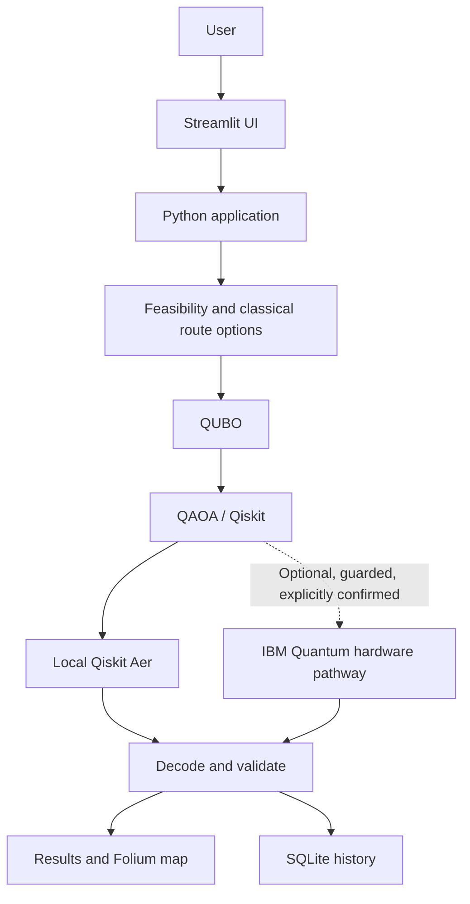

# QuantumRoute — Hackathon Pitch

Slide-ready content for a short presentation. The figures and route details
shown during the pitch should come from the current application run; this deck
does not invent performance metrics or IBM hardware results.

## Slide 1 — Title

**QuantumRoute** 
**Quantum-Enhanced Dynamic Last-Mile Route Optimisation**

Team: **K-NOVA**

*A hybrid classical + quantum workflow for small, constrained delivery
scenarios.*

## Slide 2 — The Problem

- A dispatcher must assign several deliveries across vehicles.
- Vehicle capacity, delivery time windows, and working shifts limit valid
  assignments.
- Traffic changes and unavailable vehicles can invalidate a plan.
- Cost, travel time, and sustainability can point toward different choices.

**Takeaway:** a useful plan must satisfy operational constraints before its
trade-offs are compared.

## Slide 3 — Our Solution

- Generate and validate feasible vehicle routes with the existing classical
  routing layer.
- Formulate the feasible route-selection problem as a QUBO.
- Use QAOA through Qiskit and sample locally with Qiskit Aer.
- Decode observed samples and validate selected routes again.
- Re-optimize when the simulated traffic or fleet scenario changes.

The classical optimizer remains the practical baseline. The quantum workflow
is an experiment, not a claim of quantum advantage.

## Slide 4 — How It Works

IBM hardware is an **optional pathway**. Local simulation does not require IBM
credentials.

## Slide 5 — The Quantum Core

- **Route variables:** one binary variable per feasible vehicle-route option.
- **QUBO:** route costs form the objective; penalties encode exact delivery
  coverage and at-most-one route per vehicle.
- **QAOA:** a parameterized circuit samples candidate route selections.
- **Qiskit + Aer:** build the circuit and run local simulation.
- **IBM Quantum Runtime:** guarded hardware pathway for the supported
  four-variable Demo Mode case; a dry run checks readiness without submitting
  work.

Every decoded candidate is checked against the route and delivery constraints.

## Slide 6 — Dynamic Intelligence

- **Traffic:** apply a selectable simulated traffic profile and re-optimize.
- **Fleet disruption:** mark a vehicle unavailable, prioritize deliveries,
  reassign feasible work, and show any waitlist.
- **Multi-objective choices:** Cost, Time, Green, or Balanced.

These are scenario changes in the application, not live traffic, GPS, or fleet
feeds.

## Slide 7 — Demo and Results

- Show the baseline route and feasibility outcome.
- Compare the classical result with the local Aer QAOA sample.
- Show the app's Normal-to-Heavy traffic comparison.
- Show the simulated van-2 disruption and updated fleet metrics.
- Point to the route map and objective/sustainability summaries.

Use the current run's displayed distance, time, cost, vehicle assignment,
fuel, and tailpipe CO2. **Do not add a hardware result:** no verified real
hardware execution is recorded for this demonstration, and matching local
results are not quantum advantage.

## Slide 8 — Technology Stack

- **UI:** Streamlit
- **Backend:** Python
- **Quantum optimization:** Qiskit, Qiskit Optimization, Qiskit Algorithms,
  Qiskit Aer, QAOA
- **Optional hardware pathway:** IBM Quantum Runtime
- **Routing and visualization:** optional OSRM road-routing, Folium,
  Streamlit-Folium
- **Local history:** SQLite

## Slide 9 — Intended Impact

QuantumRoute makes it possible to inspect how route feasibility and
cost/time/sustainability priorities interact as a small scenario changes.

- Compare route distance, travel time, and cost.
- See vehicle assignments and unassigned deliveries.
- Inspect configured fuel use and estimated tailpipe CO2.
- Keep decisions reviewable through maps and local operation history.

These are application capabilities, not quantified business savings or
performance claims.

## Slide 10 — Limitations and Future Scope

**Current limitations**

- Small, deterministic synthetic scenarios; traffic and breakdowns are
  simulated.
- Optional OSRM road alternatives are separate from the optimizer's selected
  route.
- QAOA is stochastic; quantum advantage and speedup are not established.
- No verified real IBM hardware result is available for this demonstration.
- External Hindsight integration is not active.

**Possible future work**

- Conduct and document explicitly approved real IBM hardware experiments.
- Explore larger problems and improve scalability.
- Add stronger verified live-data integration.

Future work is not presented as an implemented feature.
